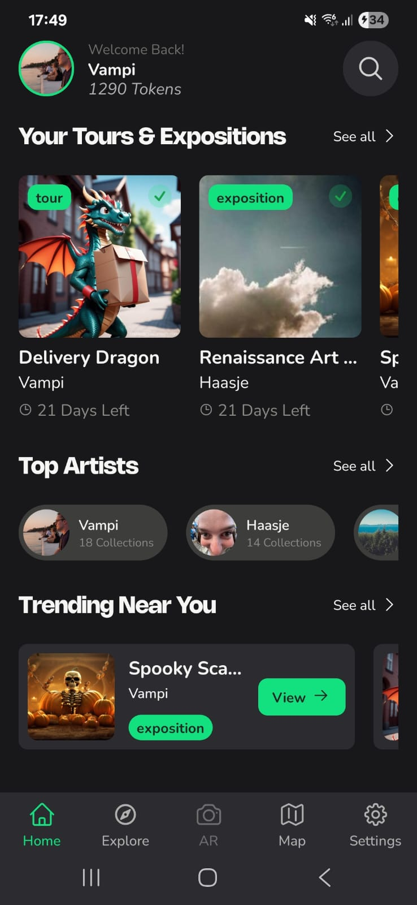
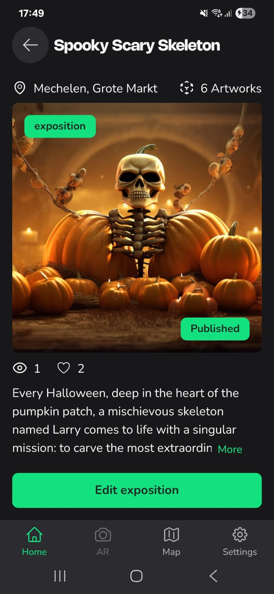
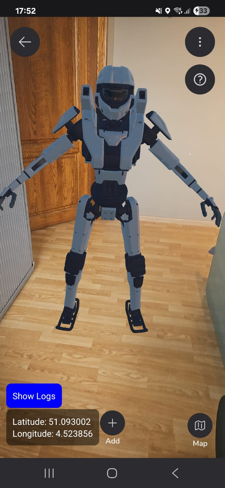

# Obsense App

Obsense is an immersive AR (Augmented Reality) mobile application that allows 3D-artists to create, place, and edit digital art collections in AR. Users can browse, purchase, and experience these collections in augmented reality.

## Features

## Screenshots

<table>
  <tr>
    <td></td>
    <td></td>
    <td></td>
  </tr>
  <tr>
    <td align="center">Home Screen</td>
    <td align="center">Collection Details</td>
    <td align="center">AR Collection View</td>
  </tr>
</table>

### Artist Features

- Artist authentication
- Place 3D-objects in AR collections
- View and interact with collections in AR
- User profile and settings management

### User Features

- User authentication
- Browse collections, artists, and genres
- Search and purchase collections
- Token-based purchasing system
- View and interact with collections in AR
- User profile and settings management
- Reporting

## Installation

1. **Clone the repository:**

   ```bash
   git clone git@github.com:Stijn-Houwelijckx/obsense-app.git
   cd obsense-app
   ```

2. **Install dependencies:**

   ```bash
   npm install
   # or
   yarn install
   ```

3. **Start the Metro bundler:**

   ```bash
   npx react-native start
   ```

4. **Prepare your Android device:**

   - Connect your Android device to your computer with a USB cable.
   - Enable Developer Mode and USB debugging on your device.
   - In a terminal, run:

   ```bash
   adb devices
   ```

   Approve the connection on your device if prompted.

5. **Run the app on Android:**

   Choose the option to run for Android

   > **Note:** The app requires a physical device because it uses AR features that are not supported in emulators.

## Usage

### For Artists

- Sign up as an artist
- Edit your own collections
- Place 3D-objects in AR collections
- View and interact with your collections in AR

### For Users

- Sign up as a user
- Browse collections, artists, and genres
- Purchase collections using tokens
- View and interact with collections in AR

## Project Structure

```
src/
  components/      # Reusable UI components
  context/         # React context providers
  navigation/      # Navigation stacks and tab navigators
  screens/         # App screens (User, Artist, Shared)
  styles/          # Theme and global styles
  utils/           # API, helpers, and utility functions
  assets/          # Images, animations, and videos
```

## Technologies

- React Native
- @reactvision/react-viro (AR)
- React Navigation
- AsyncStorage
- Axios
- FastImage
- Custom UI components

## License

This project is licensed under the Obsense Proprietary License. See the [LICENSE](LICENSE) file for details.

## Privacy Policy

**Obsense**  
_Last updated: June 2025_

This privacy policy applies to the Obsense mobile application, developed as part of a bachelor thesis project at Thomas More University, Belgium.

### 1. Information We Collect

- **Personal Data:**  
  When you create an account, we collect personal information such as your name, email address, and password. This information is used to create and manage your account and to provide access to app features.

- **Camera Access:**  
  The app uses your device’s camera solely for augmented reality (AR) functionality. No camera images or video are stored or transmitted by the app.

- **Location Data:**  
  When you place AR objects, the app collects your device’s location (latitude and longitude) and sends this information to our backend server. This data is used to associate AR objects with real-world locations and may be stored on our servers.

### 2. How We Use Your Information

- Personal data is used to create and manage your account, authenticate users, and provide access to app features.
- Camera and location access are used exclusively to provide AR features within the app.
- Location data is stored on our backend to enable location-based AR experiences.
- No data is shared with third parties except as required to provide app functionality.

### 3. Third-Party Services

- The app may use third-party services (such as Google Maps for map features) which have their own privacy policies.  
  We do not share any user data with these services beyond what is necessary for app functionality.

### 4. Children’s Privacy

- The app is intended for general audiences and does not knowingly collect information from children.

### 5. Contact

If you have any questions about this privacy policy or the app, please contact:

**Obsense Email**  
Email: info@obsense.be
